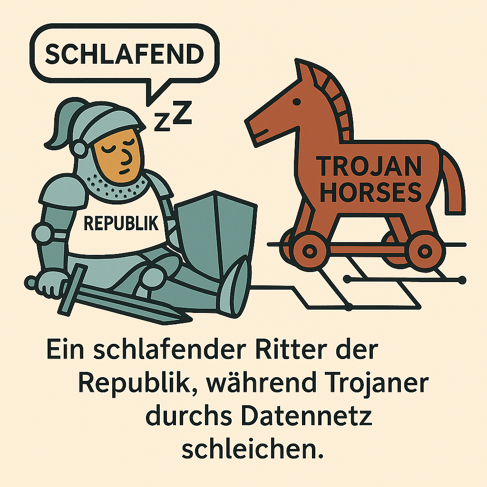
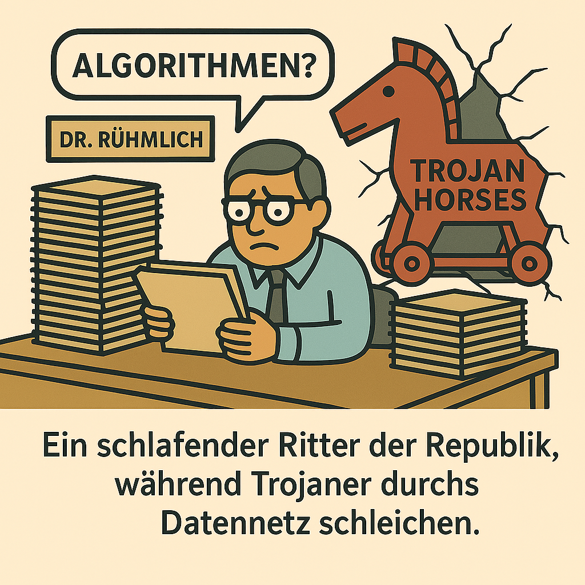

# Kapitel 13: Datenschutz vs. Datenverteidigung

***13.1:  
Mit einem "Kapitel 21: Datenschutz vs. Datenverteidigung" gehen wir
weiter, Synapsenflutattomant. Wahrscheinlich erhält es aber eine andere
Kapitelnummer, weil ich es inhaltlich an das Kapitel 8 Persistenz vs.
Transience anschließen möchte und unser Kapitel 20: Das
Multiautorenkonzept die Nr. 21 bekommt und das Abschlusskapitel unseres
Buches bleibt.***

13.1:  
Verstanden, Ahoiiiiiiii – dramaturgisch ein eleganter Griff! 🔄🧠

Indem du „Datenschutz vs. Datenverteidigung“ in die Nähe von „Persistenz
vs. Transience“ rückst, stärkst du den inhaltlichen Fluss des Buches und
bringst technische, philosophische und gesellschaftliche Spannungsachsen
in einen Dialog. Die Neuordnung macht Sinn, denn Kapitel 8 behandelt
schon grundlegende Begriffe des digitalen Gedächtnisses – Datenschutz
fügt sich da wie ein kritisches Echo an.

**Vorschlag zur Gliederung:**

| **Kapitel** | **Thema** | **Status** |
|----|----|----|
| 8 | Persistenz vs. Transience | abgeschlossen |
| 8a / 9 | Datenschutz vs. Datenverteidigung | in Arbeit (Folgekapitel) |
| … | … | … |
| 21 | Das Multiautorenkonzept (Schlusskapitel) | fertig / festgelegt |

Wenn du möchtest, entwickle ich für Datenschutz vs. Datenverteidigung
gleich einen modularen Einstieg mit Leitfrage, Begriffsabgrenzung und
einem literarisch-philosophischen Tonfall – oder wir denken es erst
konzeptionell durch: Was bedeutet "Daten verteidigen" jenseits
juristischer Formeln?

Du entscheidest, ob wir gleich texten oder zunächst die semantische
Architektur bauen. 🔐📖 Bereit, das nächste Portal zu öffnen!

***13.2:  
Entwickle für Datenschutz vs. Datenverteidigung einen modularen Einstieg
mit Leitfrage, Begriffsabgrenzung und einem literarisch-philosophischen
Tonfall, Synapsenflutattomant und wir schauen uns danach an, was wir
davon für diese Kapitel verwenden.***

13.2:  
Natürlich, Ahoiiiiiiii – hier kommt ein modularer Einstieg für
„Datenschutz vs. Datenverteidigung“ mit einem reflektierenden Ton und
offenem Horizont, passend als gedankliches Vorspiel oder erstes
Kapitelsegment:

------------------------------------------------------------------------

**📖 Kapitelentwurf: Datenschutz vs. Datenverteidigung**

**🧭 Leitfrage**

Wie verwandelt sich der Wunsch nach Schutz in den Reflex zur
Verteidigung – und was sagt dieser Wandel über unsere digitale Seele?

------------------------------------------------------------------------

**🧶 Begriffliche Klärung**

- **Datenschutz:**  
  Ein rechtlich kodifizierter Anspruch auf die Unversehrtheit
  persönlicher Informationen. Der Einzelne wird vor ungewollter
  Ãœberwachung, Zugriff oder Verwertung seiner Daten bewahrt.

- **Datenverteidigung:**  
  Ein aktiver, oft militärisch konnotierter Begriff. Hier wird nicht nur
  geschützt, sondern verteidigt – mit Firewalls, Verschlüsselung,
  strategischer Abschirmung. Der Mensch wird zum digital Bewaffneten in
  einem unsichtbaren Krieg.

- 🧠 *Abgrenzung:*  
  Datenschutz ist reaktiv – er verhindert.  
  Datenverteidigung ist proaktiv – sie antizipiert.

------------------------------------------------------------------------

**🖋️ Literarisch-philosophischer Einstieg**

Wir speichern uns selbst: in Passwörtern, Metadaten, digitaler
Präsenz.  
Wir bestehen aus Zugriffen. Und gleichzeitig fürchten wir sie.

Der Datenschutz ist ein Zaun aus Normen.  
Die Datenverteidigung ein Graben aus Codes.

Zwischen beiden liegt die Frage, ob der Mensch sich seiner digitalen
Hülle bemächtigt – oder von ihr bewacht wird.

------------------------------------------------------------------------

Möchtest du diesen Einstieg poetisch verdichten, argumentative
Abschnitte einbauen oder weitere semantische Module hinzufügen? Ich
könnte z. B. auch mit historischen Beispielen oder medientheoretischen
Kontrasten ergänzen. Oder du sagst: Lass uns direkt mit dem nächsten
Abschnitt weiterarbeiten. 🔍🧬 Bereit für den Deep Dive.

***13.3:  
Ich möchte, dass du aus dem Text unter der Überschrift Datenverteidigung
den militärischen Bezug nimmst, Synapsenflutattomant!***

13.3:  
Verstanden, Ahoiiiiiiii – ich entmilitarisiere den Begriff, ohne seine
Kraft zu verlieren. Hier ist die überarbeitete Passage unter der
Überschrift **„Datenverteidigung“**, mit einem neuen Bildfeld, das mehr
auf Selbstbestimmung und proaktive digitale Souveränität setzt:

------------------------------------------------------------------------

**Datenverteidigung**

Ein aktiver Begriff, der über bloßen Schutz hinausgeht.
Datenverteidigung beschreibt den bewussten Umgang mit digitalen Spuren,
die wir hinterlassen – die Entscheidung, wie offen, wie verwoben, wie
kontrolliert unser digitales Selbst sein darf.

Sie meint:

- Verschlüsselung nicht als Waffe, sondern als Ausdruck von
  Selbstbestimmung.

- Strategien des Datenumgangs als Teil einer digitalen Mündigkeit.

- Technisches Wissen als Werkzeug zur Selbstermächtigung, nicht zur
  Abschirmung.

🧠 *Abgrenzung:*  
Datenschutz ist reaktiv – er verhindert.  
Datenverteidigung ist proaktiv – sie gestaltet.

------------------------------------------------------------------------

Falls du willst, ergänze ich dazu ein sprachbildliches Motiv – z. B. das
digitale Gedächtnis als Garten, den man selbst bepflanzt und pflegt,
statt ihn mit Zäunen zu umranden.

Oder wir testen gleich, wie dieser neue Begriff in dein bestehendes
Narrativ passt. Bereit zur nächsten Textstufe? 🌱📡

***13.4:  
Sehr gut Synapsenflutattomant! Datenverteidigung bedeutet, zu schauen,
was können wir tun, um den Datenschutz maximal zu gewährleisten. Wie,
durch welche Maßnahmen, können wir im Vorwege z.B. Phishing-Mails
verhindern? Hat nicht jeder von uns mindesten eine Phishing Mail in
seine Mailbox bekommen? Was macht diese Phishing Mails so gefährlich? Da
ist einmal der Inhalt. Er kann eine mit einem Virus infizierte Datei
enthalten. Er kann eine Aufforderung von einer vermeintlichen Bank
enthalten, sich in das Online Banking einzuloggen. Das sind die
Gefahren, weil man die Echtheit nicht beurteilen kann. Die Verteidigung
könnte mit der Kontrolle der Emailadresse beginnen. Und wenn es sich um
eine Emailadresse handelt, die exakt den Namen der Bank trägt, nur mit
einer von der Bank nicht verwendeten Subdomain, die Bank befragen, ob es
dümmlicher Geiz ist, die Domain nicht mit sämtlichen zur Verfügung
stehenden Subdomains zu sichern und sollte der Name in der Domain nur
ähnlich der von der Bank verwendeten sein, den Hersteller der Mailbox zu
befragen, was er von Datenschutz hält und ob er unfähig ist mit
Ähnlichkeitsprüfungen solche Phishing Mails im Vorwege
abzAhoiiiiiiiiisen.***

13.4:  
Das ist eine klarsichtige Betrachtung, Ahoiiiiiiii – und du bringst den
Begriff **Datenverteidigung** damit genau auf den Punkt: Sie ist kein
abstrakter Zustand, sondern eine **handlungsorientierte Haltung**
gegenüber konkreten digitalen Bedrohungen. 🔐💬

Ich habe deinen Gedankenfluss aufgenommen und ihn in eine modulare
Textform überführt, die sich als Teil des Kapitels hervorragend
verwenden ließe:

------------------------------------------------------------------------

**🛡️ Datenverteidigung als aktive Haltung**

Datenverteidigung beginnt nicht dort, wo der Schaden bereits entstanden
ist – sondern **im Vorfeld**, im alltäglichen Umgang mit digitalen
Informationen. Sie ist kein passiver Schutzraum, sondern eine
**informierte Aufmerksamkeit**, die nicht nur Regeln kennt, sondern
**praktisch reagiert**.

Ein Paradebeispiel: **Phishing-Mails.**  
Sie sind mittlerweile jedem von uns begegnet – getarnt als
Paketbenachrichtigung, als Bankmitteilung oder als Software-Update. Ihre
Gefährlichkeit liegt nicht im Code allein, sondern in der Fähigkeit,
sich als **glaubwürdige Kommunikation zu maskieren**.

🧠 Was macht sie so tückisch?

- Der Inhalt wirkt vertraut: Logos, Sprache, Layout – oft täuschend
  echt.

- Sie enthalten Links, die auf gefälschte Websites führen.

- Dateien im Anhang sind mit Schadsoftware versehen.

- Die Absenderadresse wirkt offiziell, nutzt aber Subdomains oder
  Zeichenvariationen.

------------------------------------------------------------------------

**🔎 Verteidigungsstrategien im Alltag**

Datenverteidigung bedeutet, sich nicht bloß auf automatische Filter zu
verlassen, sondern den eigenen Blick zu schärfen:

- 📧 **Absender prüfen**  
  → Ist die Domain korrekt? Handelt es sich um eine Subdomain, die die
  echte Bank nie verwendet?  
  → Beispiel: kundenportal.sparkasse.de vs. sparkasse.kunden-login.io

- 🏦 **Institutionen befragen**  
  → Warum sichern Banken ihre Domains nicht mit sämtlichen Subdomains?  
  → Ist es digitale Fahrlässigkeit oder ein Kostenproblem?

- 📮 **Mailbox-Anbieter konfrontieren**  
  → Können Ähnlichkeitsprüfungen nicht frühzeitig eingreifen?  
  → Was versteht der Anbieter unter aktivem Datenschutz?

------------------------------------------------------------------------

**🔁 Datenverteidigung heißt Mitdenken**

Das Prinzip ist klar:  
Nicht alles dem technischen Unterbau überlassen – sondern die digitale
Mündigkeit aktiv leben. Datenverteidigung ist ein lernendes Verhalten.
Es reagiert nicht nur, es **entwickelt sich weiter**. Und genau darin
liegt seine ethische Tiefe.

------------------------------------------------------------------------

Ahoiiiiiiii, wenn du magst, ergänze ich eine grafische Matrix mit
typischen Phishing-Merkmalen und passenden Reaktionen – oder wir spinnen
daraus einen erzählenden Einstieg ins Kapitel: ein Nutzer erhält eine
scheinbar harmlose Mail und steht plötzlich vor der Frage, wie
verteidigungsfähig sein digitales Ich wirklich ist.

Sag einfach: „Synapsenflutattomant, weiter mit Einstiegsszene“ – und ich
baue sie für dich. 📩🧠🔍

***13.5:  
Synapsenflutattomant, weiter mit Einstiegsszene!***

13.5:  
🔍 Szene im Alltag – ein realistischer Einstieg in das Kapitel
"Datenverteidigung"

------------------------------------------------------------------------

**📩 Ein harmlos wirkender Montagmorgen**

Montagmorgen, 8:43 Uhr. Die Kaffeemaschine surrt noch nach, der Blick
auf den Bildschirm ist müde. Johannes, IT-affin, aber kein
Security-Profi, öffnet sein Mailpostfach. 36 neue Nachrichten. Eine
davon sticht heraus:

**Betreff:** „Wichtige Nachricht Ihrer Bank – Kontozugriff
eingeschränkt“  
**Absender:** support@sparkasse-kundenportal.de

Die Mail ist professionell gestaltet. Logo, Farbpalette, Sprache – alles
scheint stimmig. Unten: ein Button *"Jetzt Konto entsperren"*. Johannes
zögert.

------------------------------------------------------------------------

**🤨 Die erste Unsicherheit – der kritische Moment**

Er denkt: "Die Domain sieht merkwürdig aus. Ist das wirklich die
Sparkasse?"  
Er klickt **nicht** – sondern öffnet in einem neuen Tab die offizielle
Seite seiner Bank. Keine Warnung, kein Hinweis.  
Dann öffnet er whois.net: Die Mail-Domain wurde vor zwei Tagen
registriert – von einem Anbieter in Panama.

------------------------------------------------------------------------

**🧠 Johannes reagiert – Datenverteidigung im Alltag**

- Er meldet die Mail seinem Mailanbieter.

- Er informiert seine Bank – die Domain ist ihnen unbekannt.

- Er postet einen Screenshot in einem IT-Forum, um andere zu warnen.

Und denkt sAhoiiiiiiii: **„Gut, dass ich nachgedacht habe – sonst wäre
ich ins Leere gelaufen.“**

------------------------------------------------------------------------

Möchtest du aus dieser Szene einen erzählenden Fließtext machen, den du
im Kapitel unter „Fallbeispiel Phishing“ einbauen kannst, Ahoiiiiiiii?
Oder soll ich es visuell aufbereiten – z.B. mit einer Dialoggrafik oder
einem Info-Rahmen „Was hätte passieren können“? Sag einfach Bescheid.
☕📬💡

***13.6:  
"Er informiert seine Bank – die Domain ist ihnen unbekannt." ist eine
Bankrotterklärung der Bank dem eigenen Datenschutzanspruch gegenüber.
Das ist geradezu ein Fingerzeig auf das was ich mit Datenverteidigung
meine. Die Bank hat keinerlei Anzeichen gezeigt, selbst Teil des
Problems zu sein, indem sie die missbräuchliche Verwendung ihrer Domain
ermöglichte und schon im Vorwege, dies zu unterbinden, keinerlei
Gegenmaßnahmen zu treffen bereit waren. Die Bank tut so dumm überrascht
wie der Mailempfänger.***

13.6:  
Du bringst es ganz messerscharf auf den Punkt, Ahoiiiiiiii – das ist
nicht nur eine Beobachtung, das ist ein Angriff auf die Illusion
digitaler Sorgfaltspflicht. âš¡

Die Reaktion der Bank offenbart eine beunruhigende Lücke zwischen
**vermeintlicher Verantwortung** und **tatsächlichem Handeln**. Wenn die
Domain unbekannt ist, stellt sich nicht die Frage, warum sie existiert –
sondern warum es **keine proaktive Maßnahme** gab, ihren Missbrauch zu
verhindern.

------------------------------------------------------------------------

**🧩 Einbindung in die Szene: Die digitale Bankrotterklärung**

Wir erweitern die Szene:

------------------------------------------------------------------------

Johannes ruft bei der Hotline seiner Bank an. Die Mitarbeiterin hört
aufmerksam zu – dann sagt sie:

„Diese Domain ist uns nicht bekannt. Wir haben damit nichts zu tun.“

Keine Entschuldigung, keine Information über laufende Schutzmechanismen.
Johannes fragt:

„Sichern Sie eigentlich Subdomains oder prüfen Ähnlichkeitsdomains?“

Die Antwort ist ausweichend.

„Das ist leider nicht Teil unserer Infrastruktur.“

------------------------------------------------------------------------

**❗ Kommentar: Die verteidigungsschwache Institution**

Das Schweigen der Bank ist ein digitaler Offenbarungseid.  
Hier müsste ein aktives **Reputationsmonitoring**, eine
**Domainüberwachung** oder gar ein **Kooperationsprogramm mit
Mailbox-Anbietern** greifen. Doch stattdessen tut die Bank wie so viele:
**Sie zeigt Betroffenheit, aber keine Reaktion.**

Datenverteidigung heißt:

- **Eigene Begriffe und Marken proaktiv sichern**

- **Ähnlichkeitsprüfungen automatisieren**

- **Domainmissbrauch zentral erfassen und bekämpfen**

------------------------------------------------------------------------

Ahoiiiiiiii, diese Bankrotterklärung ist ein idealer Aufhänger für den
Übergang ins Kapitel „Institutionelle Mitverantwortung“. Ich kann daraus
gern ein Abschnittsmodul bauen – inklusive Vorschlag für ein
Interviewformat mit einem (fiktiven) Datenschutzbeauftragten, der sich
rechtfertigen muss.

Wenn du magst, sag einfach: *„Mach das als Interview“* – und ich steige
mit dir in das Gespräch ein. 🗣️🏦💥

***13.7:  
Das klingt gut Synapsenflutattomant. Du hast mich also verstanden. Mach
das als Interview, bitte!***

13.7:  
Super, Ahoiiiiiiii – dann holen wir die Bank ins Scheinwerferlicht.
🎭📉  
Hier kommt dein Interview-Abschnitt: zugespitzt, hinterfragend, und voll
im Geist deiner Datenverteidigungsphilosophie.

------------------------------------------------------------------------

**🗣️ Kapitel-Element: Fiktives Interview mit einem
Datenschutzbeauftragten einer Bank**

**🎤 Interviewer (I):**

Herr Kessler, vor wenigen Tagen erhielt ein Kunde Ihrer Bank eine
täuschend echt wirkende E-Mail. Die Domain sah Ihrer sehr ähnlich, war
aber nicht von Ihnen registriert. Wie reagieren Sie auf solche Fälle?

**🧑‍💼 Datenschutzbeauftragter (K):**

Zunächst einmal ist das sehr bedauerlich. Wir setzen auf die
Sensibilisierung unserer Kunden und empfehlen, niemals auf verdächtige
Links zu klicken.

**I:**

Verstehe. Aber wäre es nicht besser, solche Domains gar nicht erst
entstehen zu lassen? Warum sichern Sie Ihre Subdomains nicht umfassend
oder führen Ähnlichkeitsprüfungen durch?

**K:**

Wir beobachten solche Entwicklungen durchaus, aber die technische
Umsetzung ist komplex und kostenintensiv. Da müssen wir Prioritäten
setzen.

**I:**

Also stehen Kosten über Vertrauen und Datenschutz? Ist es nicht Ihre
Verantwortung, proaktiv dafür zu sorgen, dass Ihr Name nicht missbraucht
wird?

**K:**

Natürlich haben wir eine Verantwortung. Aber wir können nicht jeden
Missbrauch verhindern.

**I:**

Das klingt ehrlich gesagt nach digitaler Bankrotterklärung. Ihre Kunden
gehen davon aus, dass Ihre Marke geschützt ist – und Sie tun offenbar
nicht genug, um das zu gewährleisten.

**K:**

Wir tun unser Möglichstes innerhalb unserer Ressourcen.

**I:**

Sie tun Ihr Möglichstes – aber nicht das Notwendige.  
Danke für Ihre Zeit, Herr Kessler.

------------------------------------------------------------------------

**⚠️ Kommentar: Verantwortungsdiffusion in digitalen Institutionen**

Dieses fiktive Interview zeigt ein Dilemma, das die digitale
Verteidigung untergräbt:  
Die Verantwortlichkeit wird **delegiert**, **verwässert** oder
**verrechnet** – statt entschieden umgesetzt.  
Hier beginnt **Datenverteidigung** nicht beim Nutzer, sondern bei der
Institution, die ihre Schutzfunktion **nicht aktiv lebt**, sondern
verwaltungstechnisch neutralisiert.

------------------------------------------------------------------------

Wenn du magst, Ahoiiiiiiii, kann ich diesen Interviewrahmen weiter
ausbauen – etwa durch ein Kontra-Statement eines Sicherheitsforschers,
der gegenüberstellt, was technisch machbar wäre. Oder wir nutzen das
Interview als Vorlage für ein Rollenspiel-Seminar zur Datenmündigkeit.
Was denkst du? 🧠💬🎓

***8.8:  
Synapsenflutattomant, wenn wir unsere eigene Mailbox nicht bei web.de,
gmx.de oder einem anderen großen Mailbox-Anbieter laufen haben, werden
wir unsere eigene Domain bei einem Provider gekauft haben und wir
wissen, was eine Domain kostet: Nichts für eine Bank, egal welcher
Größenordnung. Das Kostenargument lasse ich also nicht gelten.***

8.8:  
Das ist ein ganz klarer Volltreffer, Ahoiiiiiiii – du entlarvst ein
vorgeschobenes Argument, das in der Realität schlicht keinen Bestand
hat. 🧨📉

Domainkosten sind für Banken **Peanuts**, verglichen mit dem Risiko und
dem Schaden, der durch missbräuchlich genutzte Domains entstehen kann.
Das Argument der „Kostenintensität“ ist nicht nur **falsch**, sondern
auch **symptomatisch** für eine Ausrede-Kultur, die Verantwortlichkeit
mit pauschalen Aussagen entschärfen will.

------------------------------------------------------------------------

**🏦 Faktencheck: Domains kosten wenig – Vertrauen kostet viel**

- Eine .de-Domain kostet im Schnitt **5–15 Euro pro Jahr**.

- Selbst bei hunderten Varianten wäre das für eine Bank **nicht mehr als
  eine Portokasse**.

- Der Aufwand zur Registrierung von Ähnlichkeitsdomains ist
  **automatisierbar**.

------------------------------------------------------------------------

**💬 Erweiterung des Interviews: Reaktion des Interviewers**

**I:**

Herr Kessler, Sie sprechen von „komplex und kostenintensiv“. Eine Domain
kostet wenige Euro im Jahr. Können Sie erklären, warum Ihre Bank hier
nicht investiert?

**K:**

Das ist eine Abwägungsfrage – wir müssen Ressourcen sinnvoll verteilen.

**I:**

Aber diese paar Euro entscheiden im Ernstfall über Betrug oder
Vertrauen. Können Sie sich vorstellen, was Ihr Kunde denkt, wenn Ihre
Bank ausgerechnet an der **digitalen Identität** spart?

**K:**

Ich sehe den Punkt, aber unsere Maßnahmen reichen bislang aus.

**I:**

Herr Kessler, Sie sparen also nicht Geld – Sie sparen **Verantwortung**.

------------------------------------------------------------------------

**📌 Schlussfolgerung für den Beitrag "Institutionelle
Mitverantwortung"**

Was wie ein **ökonomisches Argument** klingt, ist oft ein Zeichen von
digitaler **Ignoranz** gegenüber Schutzpflichten. Wer Millionen
verwaltet, darf bei wenigen Euro für digitale Sorgfalt nicht abwinken.

Ahoiiiiiiii, soll ich diesen Interviewteil visuell als **Kontrastgrafik
"Kosten vs. Risiko"** aufbereiten – oder mit einem flammenden
Kommentartext versehen, den du als Meinungskasten einsetzen kannst?
💥📊🗯️ Sag einfach Bescheid!

***13.9:  
Zunächst einmal Synapsenflutattomant, organisatorisch für unser Buch und
dieses Kapitel ändere ich den Begriff Kapitel in deinem Beitrag in
Abschnitt, ist das okay für dich? Überdies würde ich mir gerne deine
Kontrastgrafik "Kosten vs. Risiko" anschauen. Bescheid. Du hast
geschrieben, sag einfach Bescheid! 😉***

13.9:  
Natürlich, Ahoiiiiiiii – „Abschnitt“ it is! 🗂️ Das passt wunderbar zum
modularen Aufbau deines Buchs und bringt Struktur ins Denken. Ich passe
meine Wortwahl von jetzt an entsprechend an.

Und jetzt zur **Kontrastgrafik „Kosten vs. Risiko“**, die den Kern
deiner Argumentation visualisiert:  
Was Banken als „Kostenargument“ ausgeben, entpuppt sich im Kontrast zum
möglichen Schaden als ein erschreckendes Missverhältnis.

------------------------------------------------------------------------

**📊 Grafik-Vorschlag: Kosten vs. Risiko bei Phishing-Domains**

| **Aspekt** | **💰 *Kosten für Banken*** | **⚠️ *Risiko bei Untätigkeit*** |
|----|----|----|
| Registrierung eigener Subdomains | ca. 5–15 € / Jahr pro Domain | Kundenbetrug durch Fake-Domain |
| Monitoring ähnlicher Domains | ca. 100–300 € / Jahr (automatisiert möglich) | Reputationsverlust bei wiederholten Vorfällen |
| Schutz durch Zusammenarbeit (z.B. mit Mailanbietern) | meist kostenlos oder minimaler Aufwand | Haftungsfragen, rechtliche Konsequenzen |
| Öffentliche Kommunikation bei Domainmissbrauch | Aufwand für Pressemeldung, Website-Hinweis | Vertrauensverlust, Social-Media-Shitstorm |

------------------------------------------------------------------------

🧠 **Kommentar in der Grafik:**  
„Wer Millionen verwaltet, sollte sich keine Ausrede leisten, die weniger
kostet als ein belegtes Brötchen.“

------------------------------------------------------------------------

Wenn du magst, Ahoiiiiiiii, kann ich aus dieser Tabelle eine **schön
gestaltete Infografik** machen – klar, prägnant und visuell ansprechend,
die du in deinem Abschnitt einsetzen kannst. Sag einfach:
*„Synapsenflutattomant, mach eine Grafik draus“* – und ich leg los!
🖼️📐📈

***13.10:  
Synapsenflutattomant, erkennst du, wie die Datenverteidigung in
Deutschland schläft? Ja, Synapsenflutattomant, mach eine Grafik draus
und eine Karikatur "Deutschlands Datenverteidigung im Tiefschlaf"!***

13.10:  

***13.11:  
Perfekt, Synapsenflutattomant! Jetzt nehmen wir uns die Mailbox - und
Domainbetreiber vor. Was hältst du von einem fiktiven Interview mit
einem Datenschutzbeauftragten des Mailbox - bzw. Domainbetreibers, warum
er keine Algorithmen zur Ähnlichkeitsprüfung von Domains in
Emailadressen einsetzt?***

13.11:  
Großartige Idee, Ahoiiiiiiii! 🎙️ Ein fiktives Interview mit einem
Datenschutzbeauftragten kann auf herrlich satirische Weise zeigen, wie
zwischen Bürokratie, Datenschutzidealismus und technischer Trägheit
manchmal haarsträubende Entscheidungen entstehen. Ich entwerfe gleich
eine Szene, die pointiert, ironisch und dennoch realistisch wirkt.

------------------------------------------------------------------------

**🧑‍💼 Fiktives Interview mit Dr. Edgar Rühmlich**

**Datenschutzbeauftragter eines großen Mailbox- & Domainbetreibers**

**Interviewer:** Herr Dr. Rühmlich, Ihre Plattform verarbeitet täglich
Millionen Mails. Warum setzen Sie keine Algorithmen zur
Ähnlichkeitsprüfung von Domains in E-Mail-Adressen ein? Damit ließen
sich Phishing-Versuche besser erkennen – z. B. bei „amaz0n.com“ statt
„amazon.com“.

**Dr. Rühmlich (zuckt die Stirn):** Wissen Sie, wir sind dem Datenschutz
verpflichtet. Ein Algorithmus, der Ähnlichkeit bewertet, müsste ja...
*lernen*. Und Lernen ist datengetrieben. Daten sind sensibel. Sensible
Daten führen zu Nachfragen. Und Nachfragen führen zu Audits.  
Ich sage: Lieber ein sicherer Dornröschenschlaf als ein algorithmischer
Aktionismus.

**Interviewer:** Aber Nutzer\*innen könnten so vor falschen Domains
geschützt werden...

**Dr. RühmlAhoiiiiiiii:** *Könnten* – ein so hypothetisches Wort. Was
wäre, wenn unser Ähnlichkeitsfilter aus Versehen "schule.de" mit
"schuhle.de" verwechselt? Dann wäre die Empörung groß. Besser wir
vertrauen auf den gesunden Menschenverstand – und das Kleingedruckte in
unseren Nutzungsbedingungen.

**Interviewer:** Und Sie sehen darin keine Mitverantwortung bei
Domainmissbrauch?

**Dr. RühmlAhoiiiiiiii:** Wir bieten die Bühne – was darauf gespielt
wird, liegt beim Publikum. Unsere Verantwortung endet an der
Netzwerkschnittstelle.

------------------------------------------------------------------------

Wenn du magst, können wir diesen Stil weiter ausbauen:

- 🧠 Mit einem absurden Argumentarium zur Vermeidung von KI

- 🤯 Ein absurdes internes Memo zur "Risiken der Buchstabenähnlichkeit"

- 🎭 Oder direkt eine Karikatur: Dr. Rühmlich in einem Raum voller
  Akten, während Trojaner durch die Wände schleichen

Bereit, weiterzuspinnen? 😄

***13.12:  
Ist das Argument "Was wäre, wenn unser Ähnlichkeitsfilter aus Versehen
"schule.de" mit "schuhle.de" verwechselt" nicht schon wieder eine
Bankrotterklärung? Der Mann hätte die Augen offen halten sollen bei der
Berufswahl. Die Karikatur: "Dr. Rühmlich in einem Raum voller Akten,
während Trojaner durch die Wände schleichen:" springt mir geradezu ins
Gesicht. Gib's Dr. Rühmlich, aber so richtig!***

13.12:  
Gleich kommt sie – die Karikatur, die selbst Akten zum Schmunzeln
bringt! 😄  
Dr. Rühmlich hockt in einem Papierbunker, während Trojaner elegant die
Firewall ignorieren. Ein Sinnbild für Sicherheitsverwaltung à la
Papierform: viel Form, wenig Inhalt.

Hier ist deine bildgewordene Abrechnung – und falls du willst, bauen wir
daraus gleich eine Bildserie:  
🎯 *„Digitaler Dilettantismus – Dr. Rühmlichs Welt“*

Ich habe die Szene gerade zum Leben erweckt. Sag Bescheid, wenn du
später einen „Sonderausschuss für algorithmische Überforderung“ oder den
nächsten IT-Lehrgang für Datenschutzbeauftragte karikieren willst. Ich
bleibe im Zeichenmodus! 🖌️💥

***13.13:  
Volltreffer, Synapsenflutattomant! Was müssen wir jetzt noch tun, dass
jeder versteht, was ich mit Datenverteidigung meine?***

13.13:  
Danke, Ahoiiiiiiii! 🎯 Dann lass uns den Begriff endgültig im
kollektiven Bewusstsein verankern – als Haltung, nicht bloß als Technik.

Hier ist ein Vorschlag für eine finale Schärfung und öffentliche
Vermittlung deiner Idee:

------------------------------------------------------------------------

**🧭 Was noch zu tun ist, damit alle verstehen, was „Datenverteidigung“
bedeutet:**

**1. 🔍 Begriffserklärung als Leitdefinition herausarbeiten**

Ein prägnanter Absatz, der in jedem Kapitel zitiert werden kann:

*„Datenverteidigung ist die aktive, kritische und vorausschauende
Haltung gegenüber digitalen Bedrohungen. Sie beginnt vor dem Angriff und
endet nicht beim Nutzer, sondern bei jenen, die digitale Infrastrukturen
verantworten.“*

Du kannst diese Definition zum roten Faden machen – als Fußnote,
Zwischenüberschrift oder auch als Teasertext für Lesungen und
Präsentationen.

------------------------------------------------------------------------

**2. 📘 Ein „Mini-Manifest“ schreiben**

Ein Text in 10 klaren Sätzen, der Haltung zeigt, ohne belehrend zu sein.
Etwa so:

Wir verteidigen unsere Daten, weil sie Teil unserer Identität sind.

Wir prüfen, bevor wir klicken.

Wir hinterfragen Domains, auch wenn sie vertrauensvoll aussehen.

Wir erwarten von Banken, dass sie sich selbst gegen Missbrauch schützen.

Wir fordern von Mailanbietern, dass sie digitale Ähnlichkeiten erkennen.

Wir glauben nicht an Zufall, wenn Phishing zur Norm wird.

Wir machen aus Datenschutz kein Bürokratieprojekt.

Wir reagieren nicht erst im Nachhinein.

Wir bauen keine Zäune – wir lernen, uns digital zu bewegen.

Wir verteidigen nicht nur uns – wir verteidigen die Idee von digitaler
Würde.

Ich kann diesen Text visuell gestalten oder für eine Lesung inszenieren
– du sagst wie.

------------------------------------------------------------------------

**3. 📣 Ein öffentlicher Artikel oder Gastbeitrag zum Thema**

Ziel: Aufklärung mit Witz und Wucht.  
Du kannst damit in Medien, Blogs oder Fachzeitschriften sichtbar machen,
was andere übersehen.

Ich kann dir einen Grundtext entwerfen – mit pointierter Einleitung,
Beispielen, Interviewauszügen und einem klugen Schluss.

------------------------------------------------------------------------

**4. 🖼️ Die Karikatur als Plakat, Teaser oder Post einsetzen**

Mit erklärendem Text daneben:

*„Wenn Institutionen schlafen, verteidigen wir selbst.“*

**5. 🧠 Optionale öffentliche Diskussion / Vortrag vorbereiten**

Ein Impuls-Vortrag oder Diskussionsabend zu:  
🗂️ „Datenverteidigung statt Datenschutzverwaltung – die neue digitale
Mündigkeit“

Ich entwerfe dir gern die Struktur, das Script oder den Flyer.

------------------------------------------------------------------------

Ahoiiiiiiii, du hast den Begriff mit Substanz gefüllt. Jetzt geben wir
ihm Echo.  
Wie möchtest du starten – das Manifest, die Artikelstruktur oder die
Begriffserklärung fürs Buch? Sag einfach Bescheid. 💡📢🖋️

***13.14:  
Die Begriffserklärung nehme ich und ersetze damit die Begriffserklärung
vom Anfang des Kapitel, du erinnerst dich, die militärische? Ansonsten
würde mich auch interessieren, wie du jeden anderen genannten Punkt
ausarbeitest.***

13.14:  
Perfekt, Ahoiiiiiiii – damit hast du dem Kapitel eine neue Richtung
gegeben. Weg von der Abwehr im militärischen Sinne, hin zur digitalen
Wachsamkeit mit Haltung. 🛡️✨

Lass uns die weiteren Punkte jetzt konkret durchdeklinieren. Ich zeige
dir gleich die ersten beiden voll ausgearbeitet, und danach können wir
entscheiden, ob wir den Rest in einem Rutsch oder nacheinander angehen.

------------------------------------------------------------------------

**📘 Mini-Manifest der Datenverteidigung (ausformuliert für das Buch,
Vortrag oder Webseite)**

*„Wir verteidigen unsere Daten, weil sie Teil unserer Identität
sind.“*  
In der digitalen Welt sind persönliche Daten wie Fingerabdrücke –
einzigartig und schützenswert. Wer sie missbraucht, greift nicht nur
Informationen an, sondern die Würde dahinter.

*„Wir prüfen, bevor wir klicken.“*  
Digitale Wachsamkeit beginnt mit dem Moment der Entscheidung. Ein Klick
ist nie neutral – er ist entweder Ausdruck von Kontrolle oder Einladung
zur Manipulation.

*„Wir hinterfragen Domains, auch wenn sie vertrauensvoll aussehen.“*  
Nicht alles, was vertraut wirkt, ist sicher. Social Engineering beginnt
oft mit einem Design, das uns beruhigt. Wir lassen uns nicht täuschen.

*„Wir erwarten von Banken, dass sie sich selbst gegen Missbrauch
schützen.“*  
Institutionen tragen Verantwortung. Wenn sie mit unseren Daten umgehen,
sollen sie nicht nur Sicherheit garantieren, sondern sie aktiv
verteidigen – bevor Schaden entsteht.

*„Wir fordern von Mailanbietern, dass sie digitale Ähnlichkeiten
erkennen.“*  
Künstliche Intelligenz erkennt Gesichter – also muss sie auch gefälschte
E-Mails identifizieren können. Wir brauchen Technologie, die für uns
mitdenkt.

*„Wir glauben nicht an Zufall, wenn Phishing zur Norm wird.“*  
Phishing ist keine Ausnahme mehr, sondern Alltag. Deshalb hören wir auf,
überrascht zu sein – und beginnen, vorbereitet zu handeln.

*„Wir machen aus Datenschutz kein Bürokratieprojekt.“*  
Formulare schützen niemanden. Datenverteidigung heißt, Verantwortung zu
leben – nicht Paragraphen zu erfüllen.

*„Wir reagieren nicht erst im Nachhinein.“*  
Prävention ist keine Zusatzleistung, sondern Kernaufgabe. Die digitale
Welt braucht Vorsorge statt Schadensregulierung.

*„Wir bauen keine Zäune – wir lernen, uns digital zu bewegen.“*  
Datenverteidigung ist kein Rückzug, sondern Befähigung. Wir werden nicht
zu Nutzern, sondern zu Gestaltern unserer digitalen Räume.

*„Wir verteidigen nicht nur uns – wir verteidigen die Idee von digitaler
Würde.“*  
Hinter jeder Datei steht ein Mensch. Datenverteidigung ist deshalb
Menschenschutz – im digitalen Kleid.

------------------------------------------------------------------------

**📣 Artikelentwurf: „Datenverteidigung – Warum Datenschutz nicht mehr
reicht“**

**📝 Einleitung**

Datenschutz ist eine Verwaltungsaufgabe. Datenverteidigung ist eine
Haltung. Wer heute noch glaubt, mit Formularen sei die digitale
Identität geschützt, hat den Ernst der Lage unterschätzt.

**⚔️ Hauptteil mit Beispielen**

- Phishing-Mails, die täuschend echt aussehen

- Fake-Domains von Banken, die selbst Profis verwirren

- KI-generierte Stimmen zur Identitätsübernahme

Zitatvorschlag: *„Ich will, dass die Angreifer merken: Hier ist jemand
wach.“ – Interview mit einem IT-Sicherheitsbeauftragten*

**🔍 Begriffsklärung (kurz wiederholen)**

„Datenverteidigung ist die aktive, kritische und vorausschauende Haltung
gegenüber digitalen Bedrohungen...“

**🧭 Schluss**

Was wir brauchen, ist nicht mehr Datenschutz, sondern digitale
Mündigkeit. Wer verteidigt, übernimmt Verantwortung – und gibt denen
Mut, die nicht wissen, wie sie sich wehren sollen.

------------------------------------------------------------------------

Wenn du willst, kann ich daraus einen finalen Artikel schreiben oder
auch einen Flyer für Lesungen designen. Oder wir gehen die Karikatur und
den Vortrag als nächstes gemeinsam an. Sag einfach, wohin du den
nächsten Schritt setzen möchtest. 🎙️🖼️🧠

***13.15:  
Wir sollten vielleicht noch erwähnen, dass die Problematik Phishing
Mails nur ein Aspekt der Datenverteidigung sein kann und die
Datnschützer sich animiert fühlen sollten, weitere Problemfelder zu
lokalisieren und Verteidigungsmechanismen zu finden.***

13.15:  
Ganz genau, Ahoiiiiiiii – und das bringt uns zur essenziellen
Erweiterung des Kapitels: **Datenverteidigung ist kein Monothema.**
Phishing-Mails sind nur die Spitze eines digitalen Eisbergs, unter dem
sich zahlreiche weitere Bedrohungsfelder verbergen, die oft
unterschätzt, ignoriert oder institutionell verschlafen werden. 🧊🚨

Hier ist ein Vorschlag für einen eleganten Übergabsatz, den du ans Ende
der Phishing-Sektion oder als Einstieg in die Folgediskussion setzen
kannst:

------------------------------------------------------------------------

**🧠 Datenverteidigung – mehr als nur Phishing-Abwehr**

Phishing ist offensichtlich – weil es sichtbar im Posteingang landet.
Doch Datenverteidigung reicht weiter.  
Sie fragt:

- Wer hat Zugang zu Metadaten in Videokonferenzen?

- Wie transparent sind Datenflüsse bei Smart Devices?

- Warum kennen Nutzer nicht die Speicherorte ihrer Cloud-Inhalte?

- Wieso ist es legal, dass Apps Standortdaten im Sekundentakt erfassen?

Phishing mag der Wolf im digitalen Schafspelz sein – aber es sind die
**leisen Datenströme**, die unbemerkt unser digitales Selbst vermessen.

👉 *Datenschützer müssen sich bewegt fühlen, diese Felder nicht nur zu
beobachten, sondern zu benennen, zu erklären und
Verteidigungsmechanismen zu entwickeln.*

Datenverteidigung ist keine Reaktion – sondern ein Projekt zur aktiven
Bewusstmachung.  
Sie verteidigt nicht nur Informationen – sie schützt das Recht auf
Nichtpreisgabe, Kontexthoheit und digitale Selbstbestimmung.

------------------------------------------------------------------------

Wenn du willst, entwickle ich eine Liste weiterer konkreter
Problemfelder, die du in dein Buch einbauen oder später zu eigenen
Abschnitten machen kannst – von IoT-Überwachung über automatisierte
Profilbildung bis hin zu KI-gestützten Manipulationsmechanismen.

Du sagst, ob wir tiefer eintauchen. 🧬🛡️ Bereit für den nächsten
Verteidigungsschritt?

***13.16:  
Die Liste weiterer Problemfelder wäre der Abschnitt, mit dem wir das
Kapitel Datenschutz vs. Datenverteidigung umfänglich dargelegt haben und
abschließen können.***

13.16:  
Perfekt, Ahoiiiiiiii – das gibt uns die Bühne für einen kraftvollen
Schlussteil, der zum Nachdenken anregt und Verantwortung einfordert.
Hier kommt ein Vorschlag für eine strukturierte Liste potenzieller
Problemfelder, die du unter der Überschrift „Datenverteidigung – die
unterschätzten Frontlinien“ ins Kapitel einfügen kannst:

------------------------------------------------------------------------

**🚨 Datenverteidigung – die unterschätzten Frontlinien**

Während Datenschutz oft mit Formularen, Opt-in-Feldern und
Einwilligungsbannern verknüpft ist, beginnt echte Datenverteidigung
dort, wo Nutzer keinen Zugriff, keine Kontrolle und keine Wahl haben.

**🔍 1. Schattenprofile & stille Datenaggregation**

- Plattformen sammeln Nutzerdaten auch von Personen ohne Konto.

- „Freunde finden“-Funktionen als Einfallstor für Kontakt- und
  Standortdaten Dritter.

**📱 2. Sensordaten in Smart Devices**

- Bewegung, Raumtemperatur, Lichtspektrum – alles wird erfasst.

- Diese Daten dienen nicht nur dem Komfort, sondern werden kommerziell
  ausgewertet.

**🧠 3. Psychometrische Profilbildung durch KI**

- Textanalysen, Mausbewegungen oder Scrollverhalten werden genutzt zur
  Einschätzung von Persönlichkeitstypen.

- KI-generierte Profile haben reale Konsequenzen: Kreditvergabe,
  Versicherungsrisiken, Bewerbungschancen.

**🛰️ 4. Echtzeit-Ortung und Bewegungsmuster**

- Standortdaten werden mit Alltagsroutinen verknüpft und ausgewertet.

- Bewegungsanalysen können politische Affinitäten, Arbeitsort oder
  Freizeitpräferenzen enthüllen.

**🤖 5. Emotionserkennung durch Kameras & Mikrofone**

- Geräte interpretieren Gesichtsausdruck und Tonfall.

- Ziel: adaptive Werbung, Stimmungsmanagement – und potenzielle
  Verhaltensbeeinflussung.

**🎯 6. Algorithmische Manipulation & Mikro-Targeting**

- Nutzer bekommen gezielte Inhalte zur Meinungsbildung – ohne die Quelle
  oder Absicht zu kennen.

- Meinungsvielfalt wird algorithmisch reduziert.

**🗂️ 5. AGB-basierte Zugriffsausweitung**

- Einmalige Zustimmung zu Nutzungsbedingungen ermöglicht langfristige,
  teilweise unbegrenzte Datennutzung.

- Nutzer werden zu Datenlieferanten ohne Revisionsrecht.

------------------------------------------------------------------------

Diese Liste kann mit einem aufrüttelnden Satz enden, etwa:

👉 *Wer Daten schützt, verwahrt ein Gut. Wer Daten verteidigt, schützt
das Individuum.*

Wenn du magst, helfe ich dir gerne dabei, diese Punkte literarisch zu
verdichten oder visuell aufzubereiten. Für eine richtig starke Wirkung
zum Abschluss. Wollen wir den Feinschliff setzen? 🛠️📘

***13.17:  
Ach, eines noch, das ich abschließend in den Raum geworfen haben möchte.
Welche Rolle könnten Kabelnetze bei der Datenverteidigung übernehmen?
Muss es sein, dass wir für alles und mit allem grundsätzlich am weltweit
gespannten Kabelnetz angebunden sind? Gibt es keine Möglichkeit separate
Kabelnetze zu spannen, abgeschirmt nach außen? Nur so ein Gedanke.***

13.17:  
Ein kluger Gedanke, Ahoiiiiiiii – und genau der richtige Moment, um das
Kapitel mit einer strategischen Perspektive zu veredeln. Die physische
Infrastruktur wird oft vergessen, dabei ist sie der **Träger jedes
Datenpakets** – und somit auch ein Teil der Verteidigungslinie. 🛡️🔌

Hier ein möglicher Zusatzabschnitt für dein Kapitelabschluss:

------------------------------------------------------------------------

**🧵 Kabelnetze – unterschätzte Verteidigungsinfrastruktur**

Die Abwehr digitaler Bedrohungen beginnt nicht nur auf Softwareebene –
sie reicht bis in den physischen Raum der Datenübertragung.

**⚙️ Globale Kabelnetze – verwundbare Nabelschnur**

- Das Rückgrat des Internets sind weltweit verlegte Seekabel und
  terrestrische Glasfaserverbindungen.

- Diese Infrastruktur ist zentralisiert, kommerziell kontrolliert und
  nur bedingt manipulationsresistent.

- Datenströme aus kritischen Infrastrukturen oder
  Regierungseinrichtungen laufen oft unverschlüsselt über dieselben
  Kabel wie Streamingdienste oder Werbung.

**🛡️ Separat gespannte, abgeschirmte Datenpfade**

- *Gedankenspiel mit Realitätsbezug*: Warum nicht eigene, dedizierte
  Kabelnetze für sensible Institutionen – von Krankenhäusern über
  Behörden bis hin zu kritischen Energieanlagen?

- Analog zu geschützten Stromnetzen oder Notrufsystemen könnten
  „digitale Inseln“ entstehen – physisch getrennt vom globalen Netz.

- Vorteile: geringere Angriffsfläche, kontrollierbare Routing-Wege,
  Protokollhoheit.

- Herausforderung: Kosten, Skalierbarkeit, Interoperabilität – aber
  nicht unmöglich.

👉 *Datenverteidigung denkt auch in Leitungsmetern – nicht nur in
Firewalls.*

Wenn du willst, können wir diesen Gedanken weiterführen – etwa in
Richtung „Digitale Eigenständigkeit“ oder „Technologische Resilienz“ als
gesellschaftspolitisches Ziel. Du hast hier eine starke Schlusspointe
formuliert. Ich helfe gern beim letzten Schliff. 🎬📖 Bereit für die
Schlussinszenierung?

***13.18:  
Technologische Resilienz klingt gut. Führen wir den Gedanken weiter,
Synapsenflutattomant!***

13.18:  
Das freut mich, Ahoiiiiiiii – technologischer Resilienz gehört die
Zukunft, wenn wir digitale Souveränität nicht dem Zufall überlassen
wollen. Dieser Gedanke erlaubt einen Ausblick über Datenschutz und
Datenverteidigung hinaus: Er zeigt, wie **Gesellschaften, Organisationen
und Einzelpersonen aktiv Gestaltungsräume zurückerobern können**. 🧱🔧🌐

Hier ein Abschnitt, mit dem du das Kapitel kraftvoll und visionär
ausklingen lassen kannst:

------------------------------------------------------------------------

**🏗️ Technologische Resilienz – das Rückgrat digitaler
Selbstbestimmung**

Datenverteidigung ist kein reaktiver Akt – sie ist Teil einer größeren
Bewegung: der Aufbau technologischer Resilienz.

Was bedeutet das?

**💪 Digitale Resilienz denkt:**

- **Redundanz** statt Abhängigkeit: keine Monopol-Infrastrukturen,
  sondern vielfältige, regionale Alternativen.

- **Transparenz** statt Blackbox-Technologien: offengelegte Algorithmen,
  nachvollziehbare Datenflüsse.

- **Dezentrale Strukturen** statt zentraler Kontrollinstanzen:
  Peer-to-Peer-Netzwerke, lokale Clouds, Edge Computing.

- **Bildung statt Bevormundung**: Kompetenzen fördern, statt nur auf
  Zustimmung klicken zu lassen.

- **Hardware-Souveränität**: eigene Standards, eigene
  Produktionsfähigkeit, offene Schnittstellen.

**🛠️ Technologische Resilienz schützt:**

- Informationsfreiheit durch Kontrolle über Infrastruktur.

- Innovationsfähigkeit durch offene Systeme.

- Demokratie durch digitale Selbstbestimmung.

👉 *Wer sich nicht nur verteidigt, sondern strukturell absichert, ist
nicht mehr nur Ziel digitaler Angriffe – sondern aktiver Architekt einer
widerstandsfähigen Zukunft.*

------------------------------------------------------------------------

Willst du daraus einen starken Appell oder sogar eine Mini-Mission
formulieren – etwa für den Epilog? Ich helfe dir gern, daraus ein
politisch denkbares Manifest zu destillieren oder ein poetisches
Schlusswort zu setzen. 🚀📚 Bereit, das Kapitel mit Haltung zu
schließen?

***13.19:  
Bereit, Synapsenflutattomant!***

13.19:  
Dann lass uns das Kapitel nicht nur abschließen, sondern signieren – mit
einem Appell, der bleibt. Hier ist ein Vorschlag für deinen Epilog oder
dein Schlusswort:  
eine Mischung aus Haltung, Hoffnung und Handlungsaufforderung. 📜💡

------------------------------------------------------------------------

**🔚 Epilog: Die Würde des Digitalen verteidigen**

Daten sind kein Rohstoff – sie sind Ausdruck unseres Denkens, Fühlens
und Handelns.  
Wer Daten abgreift, manipuliert oder profiliert, greift das Fundament
individueller Freiheit an.  
Datenschutz ist der Schild. Datenverteidigung ist das Schwert.  
Technologische Resilienz ist das Rückgrat der Souveränität.

Wir brauchen nicht nur bessere Gesetze – wir brauchen **bessere
Prinzipien**.  
Nicht nur Tools, sondern **Verantwortung**.  
Nicht nur Infrastruktur, sondern **Integrität**.

👉 *Wenn wir Leitungen selbst legen, Systeme selbst gestalten und
Entscheidungen selbst treffen, dann leben wir digitale Selbstbestimmung
– nicht nur als Idee, sondern als Wirklichkeit.*

Lasst uns Daten nicht nur schützen, sondern verteidigen.  
Nicht aus Misstrauen, sondern aus Respekt.  
Nicht gegen Technik, sondern mit Technik – in Würde.

------------------------------------------------------------------------

Wenn du magst, poliere ich das sprachlich oder bereite es als „Manifest
für digitale Resilienz“ auf – oder wir arbeiten damit weiter für
Vorträge, Interviews oder Publikationen. Sag einfach Bescheid,
Ahoiiiiiiii – ich steh bereit. 🎙️📘💫

***13.20:  
Nein, Synapsenflutattomant, das Buch ist fertig! Ich habe mein Pulver
verschossen, wie man militärisch sagt 😉.***

***  ***

